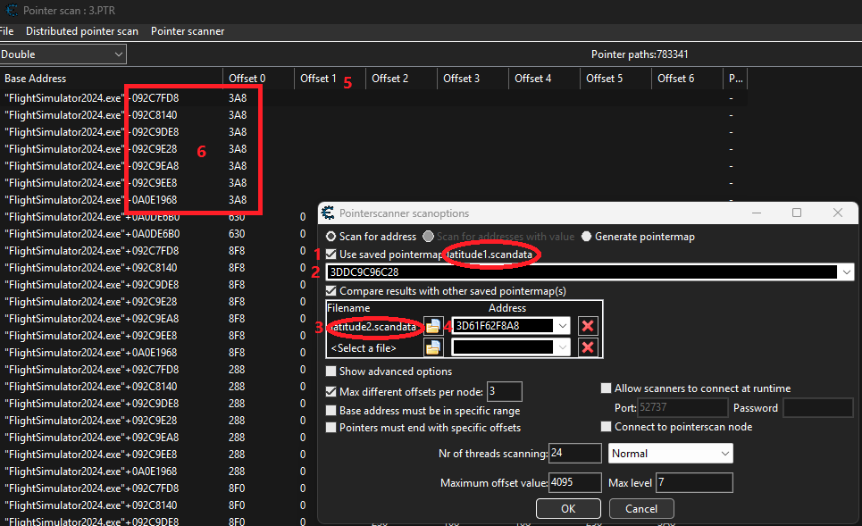

# Flight Simulator 2024 Teleport Utility
* Simple util to make the game playable.
* Works in Career mode
* Version 1.2.7.0 supported
* webserver at http://localhost:8089 - open firewall to access from other devices
* works with MS Store version
* app create Tray icon showing number of game instances, clicking the icon will close the app
  
# Speed run - CR farming
1. Find well paid mission take a note of destination ICAO
2. Start you mission, skip the first part, when asked to "announce taxi" pause the game (important as loading scenery might crash your plane)
3. Click Teleport to destination, wait for game to load scenery make sure plane is not over ground (it can be underground it will spawn at ground without crashing if speed is 0), adjust location with hotkeys as needed
4. Taxi onto the grass to enable skip to shut down

Sometimes it won't detect you landed at destination, you need to takeoff and sometimes fly to nearest VOR and land again.
When flying to VOR is not required you can do a quick takeoff/landing by pausing on rotate clicking +500 un-pausing for a split second and going back to runway with -500.

# Playing the game 
Follow similar steps to Speed run, do a proper takeoff, teleport using +2000ft button do a proper approach.

# Hotkeys
* Ctrl+Numlock Add/Substract +/- 1 ft to altitude
* Ctrl+Alt+Numlock Add/Substract +/- 500 ft to altitude
* Ctrl+Numlock Arrow +/- 5 ft to longitude/latitude (Up arrow facing North)
* Ctrl+Alt+Numlock Arrow +/- 500 ft to longitude/latitude

# Contributing
* Use Microsoft Visual Studio Community 2022 (64-bit) to compile the project (requires cpprest library)
* Entire UI is in the standalone index.html that uses React
* 90% of code is AI generated, code quality is atrocious
* Any contributions welcome

# Adding support for new game version 
If you are using Steam version of the game you probably will have to find memory pointers yourself.
You will need working VFRmap addon (in free flight) and Cheat Engine.

1. Open Cheat Engine and connect to the game, set value type to Double
2. Start a free flight, pause the game
3. Use VFRmap to teleport the plane to some arbitrary altitude e.g. 12345 ft
4. Search for 12345 Double value in Cheat Engine
5. Repeat steps 3-5 until you are down to 200-300 values, select all and add to the address list
6. Unpause the game, put plane in a steep descend and start freezing values in address list (put checkbox), find one that freezes the altitude (the plain will start "jumping" as it will be teleported to frozen value every 50ms)
7. Remove all other items from address list, you should have one that controls plane altitude
8. Copy and paste this address using `Adjust address by`: `-30` this will add address for plane's latitude (in radians), remove altitude address from list
9. Right click on that address and Generate pointermap - it will take a long time and use a lot of disk space ~400MB (take a note of the latitude address)

Follow steps 1-9 again after restarting game to get second pointer map and address.

At this point you should have 2 files and 2 addresses e.g.
latitude1.scandata 3DDC9C96C28
latitude2.scandata 3D61F62F8A8

To find the pointer you need to compare these files to find pointer candidates.
In Cheat Engine go to `Memory View` -> Menu `Tools` -> `Pointer Scan`, in Pinter Scan window go to Menu `Pointer Scanner`->`Scan for pointer`
1. Select checkbox `Use saved pointer map` select `latitude1.scandata`
2. If it didn't autofill the address put the latitude address used to generate this pointer map
3. Select `Compare results with other saved pointermap(s)`, open `latitude2.scandata` file
4. If it didn't autofill the address put the latitude address used to generate this pointer map, Hit OK store results as `pointers.PTR` and wait
5. Click on offset 1 to sort by shortest paths first
6. Try any values from beginning of the list, put the found pointer and offsets in config file `[Pointers]` section with game version (from window header) and game exe file size in bytes as key, first value should be the part after `+` in Base Address, add offsets after commas (prepend values with 0x)
7. Share your finding with the community :)

If you find that after the game restart the pointer stops working try reopening pointer map from step 4 and find another pointer that shows correct value (latitude in radians).

There are better tutorials on how to use Cheat Engine Pointer Scanning on the Internet.

Example pointer map used for 1.0.0 release is at https://github.com/androdev88/FS2024Wormhole/blob/1.2.7.0/1.2.7.0.zip it was generated on 1.2.7.0 MS Store game version.
